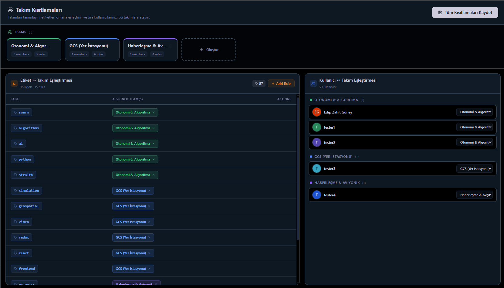
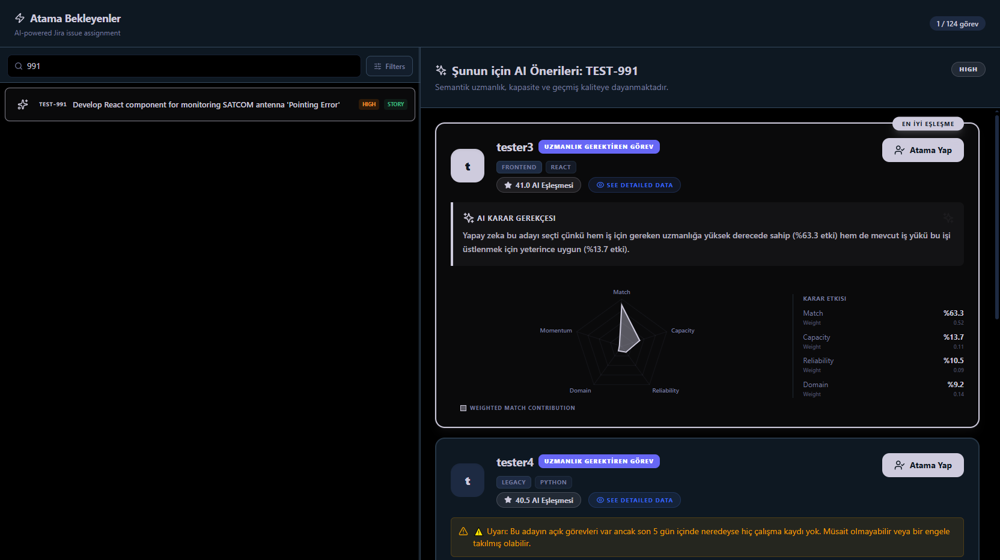
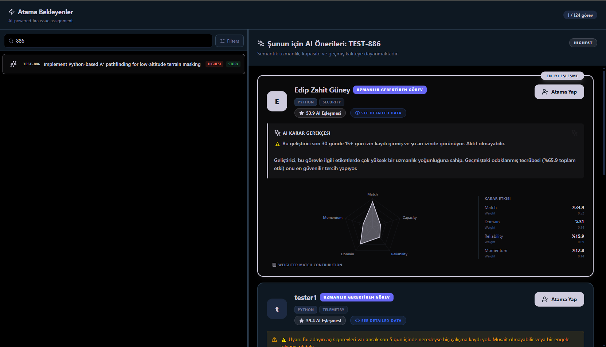

# 🚀 SİHA Projesi Demo ve Gösterim Rehberi

Bu rehber, 5 kişilik (Siz + 4 Dev) tam SİHA yazılım ekibi üzerinden **Jira Yapay Zeka Atama** sisteminin tüm yeteneklerini sergilemek için hazırlanmıştır.

---

## 👥 1. Ekip Yapısı ve Uzmanlık Matrisi

Aşağıdaki tablo, 5 kişilik (Siz + 4 Dev) tam SİHA yazılım ekibi yapısını ve uzmanlıklarını tanımlar:

| Ekip Üyesi | Jira Logini | Ana Uzmanlık (SİHA Takımı) | Temel Teknolojiler ve Görev Alanı | Örnek Geçmiş İş |
| :--- | :--- | :--- | :--- | :--- |
| **Edip Zahit Güney** | Ana Hesap | **Otonomi & Algoritma** | Python, ROS, YOLO, Rota Planlama | `TEST-886` (A* Rota Planlama) |
| **tester1** | `+dev1` | **Otonomi & Algoritma** | QA, HIL/SIL Testleri, Senaryo Geliştirme | `TEST-1001` (Yapay Görme Test Entegrasyonu) |
| **tester2** | `+dev2` | **GCS (Yer İstasyonu)** | React, WebGL, Arayüz Tasarımı (Frontend) | `TEST-991` (SATCOM Anten İzleme Arayüzü) |
| **tester3** | `+dev3` | **Otonomi & Algoritma** | Sistem Tasarımı, Haberleşme, Kubernetes | `TEST-986` (YOLOv10 Dağıtık Katman Mimarisi) |
| **tester4** | `+dev4` | **Haberleşme & Aviyonik** | C, C++, RTOS, Sensör Sürücüleri | `TEST-936` (SATCOM Telemetri Şifreleme) |

### 🏷️ Takım ve Etiket (Label) Eşleştirmeleri

| Takım Adı | Öncelikli Etiketler (Labels) |
| :--- | :--- |
| **Otonomi & Algoritma** | `swarm`, `algorithms`, `ai`, `python`, `yolo`, `pathfinding`, `stealth` |
| **GCS (Yer İstasyonu)** | `simulation`, `geospatial`, `video`, `srtm`, `redux`, `react`, `frontend` |
| **Haberleşme & Aviyonik** | `avionics`, `satcom`, `telemetry`, `embedded`, `security`, `rtos` |

---

## 🎯 2. Yapay Zeka Kapasite (Örnek İşler)

Dashboard'da **Sync** yaptıktan sonra aşağıdaki atanmamış (unassigned) işleri seçerek analiz sonuçlarını gösterin:

### **Senaryo A: Yer İstasyonu (tester3)**
*   **Seçilecek İş**: `TEST-991` ("Develop React component for monitoring SATCOM antenna Pointing Error")
*   **Beklenen Sonuç**: Sistem bu işi doğrudan **tester3**'e (GCS Uzmanı) %65+ uyumla önerecektir.
*   **Neden?**: `tester3` ekibin tek Frontend ve React uzmanı olarak işaretlendiği için.

### **Senaryo B: Karma Algoritma (tester1)**
*   **Seçilecek İş**: `TEST-1001` ("Integrate AI Vision target classification into GCS Video Stream")
*   **Beklenen Sonuç**: En yüksek puanı **tester2** veya **Edip Zahit Güney** alacaktır.
*   **Neden?**: Her iki kullanıcı da AI ve görüntülü işleme teknolojilerinde uzmandır.

---

## 🏝️ 3. İzin (Leave) & Atama Testi

Bu senaryo, sistemin en gelişmiş özelliğini (Kapasite Yönetimi) kanıtlar:

1.  **Hazırlık**: Jira'da ana hesabınızla (`Edip Zahit Güney`) giriş yapın.
2.  **Aksiyon**: **Annual Leave** biletine (veya belirlediğiniz izin biletine) 14 gün için toplam **112 saat** worklog girin.
3.  **Sync & Analiz**: Uygulamada Sync yapın ve `TEST-886` (A* Pathfinding) işini analize açın.
4.  **Sonuç**: Yapay zeka normalde Edip Zahit Güney'e (Otonomi Uzmanı) vereceği bu işi, izinde olduğunuzu (Out of Capacity) tespit ederek **REDDEDER**. 

5.  **Otomatik Yönlendirme**: İşi otomatik olarak takımdaki diğer en iyi seçenek olan **tester2** veya **tester1**'e devreder.

---